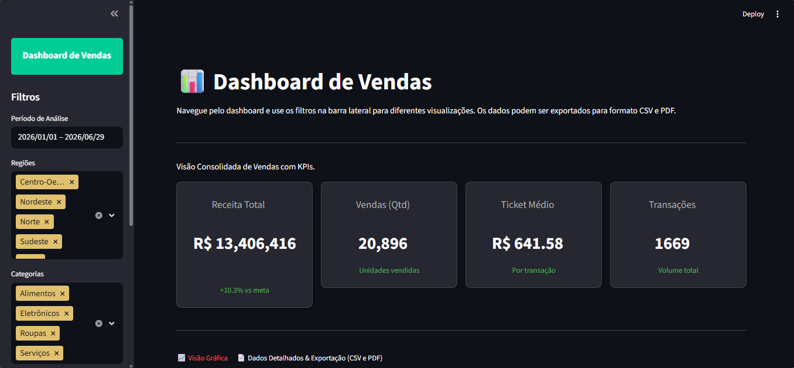
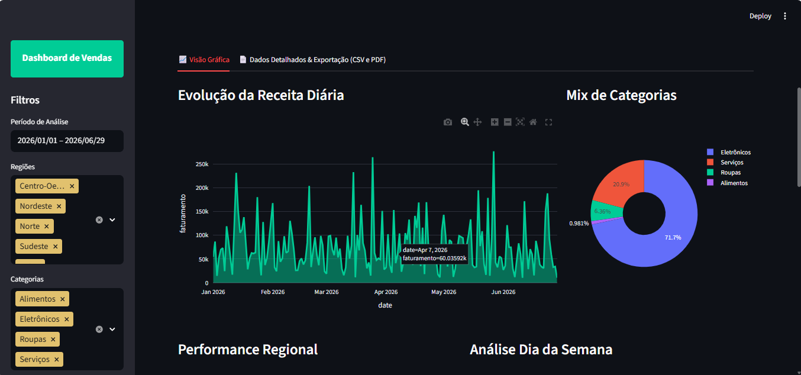
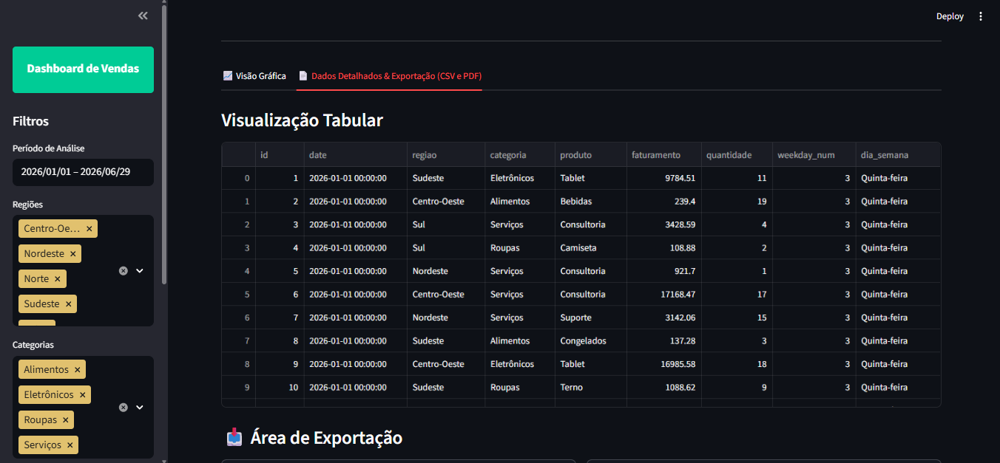

# Data App – Sales Analytics Dashboard com Streamlit

Dashboard interativo desenvolvido em Python com Streamlit para análise de dados de vendas, com KPIs dinâmicos, filtros interativos e visualizações para apoio à tomada de decisão.

## Índice
- [Visão Geral](#visão-geral)
- [Problema de Negócio](#problema-de-negócio)
- [Tecnologias Utilizadas](#tecnologias-utilizadas)
- [Metodologia](#metodologia)
- [Estrutura do Projeto](#estrutura-do-projeto)
- [Funcionalidads](#funcionalidades)
- [Instalação e Uso](#instalação-e-uso)
- [Deploy e Produção](#deploy-e-produção)

## Visão Geral

Este projeto implementa uma aplicação interativa para análise de desempenho de vendas, explorando dados através de filtros e visualizar métricas estratégicas em tempo real.
A aplicação foi desenvolvida com Streamlit, proporcionando uma experiência semelhante a de Power BI, mas com código Python.

# 📷 Preview do Dashboard

## Visão Geral do Dashboard com KPIs Estratégicos

<p align="center">
  
</p>

<p align="center">
    Painel principal com indicadores estratégicos e filtros dinâmicos.
</p>

---

## Análises Visuais e Distribuição de Categorias

<p align="center">
  
</p>

<p align="center">
    volução da receita diária e mix de categorias com visualizações interativas.
</p>

## Visualização Tabular com Dados Detalhados de Vendas

<p align="center">
  
</p>

<p align="center">
    Tabela interativa com dados completos de transações e filtros laterais para período, região e categoria. 
</p>

---

## Performance Regional e Análise de Dispersão

<p align="center">
  
</p>

<p align="center">
    Dashboard com performance regional, gráfico de dispersão quantidade vs faturamento e receita média por dia da semana.
</p>

## Análise de Dispersão com Segmentação por Produto

<p align="center">
  
</p>

<p align="center">
    Gráfico de dispersão da relação entre quantidade e faturamento com categorias de produtos destacadas por cores. 
</p>

**Principais características:**
-  Dashboard interativo
-  KPIs dinâmicos com comparação de metas
-  Filtros personalizados
-  Visualizações interativas
-  Mapa de calor de receita por dia da semana
-  Customização visual com CSS

##  Problema de Negócio

### Contexto
Empresas que operam com grande volume de vendas precisam monitorar indicadores-chave para:
- Avaliar desempenho comercial
- Comparar receita com metas estabelecidas
- Identificar padrões temporais
- Analisar comportamento de vendas por segmento


### Objetivo
Desenvolver um dashboard interativo que permita:
-  Analisar receita total
-  Comparar desempenho com metas
-  Visualizar crescimento percentual

### Benefícios Esperados
- Análise rápida e visual
- Redução de tempo em relatórios manuais
- Identificação de oportunidades estratégicas
- Melhor acompanhamento de metas
- Tomada de decisão baseada em dados

##  Tecnologias Utilizadas

| Tecnologia | Versão | Uso |
|------------|---------|-----|
| Python | 3.13 | Desenvolvimento da aplicação |
| Pandas | 2.2+ | Manipulação de dados |
| Plorly  | 5.22+ | Visualizações interativas |
| Streamlit | 1.35+ | Construção do dashboard |
| Conda | 24+ | Gerenciamento de ambiente virtual |

# Metodologia
O projeto segue uma abordagem estruturada em etapas:

## 1. Definição do Problema
- Identificação das métricas estratégicas
- Definição dos KPIs principais

## 2. Carregamento e Tratamento de Dados
- Leitura do dataset
- Conversão de datas
- Criação de variáveis derivadas (dia da semana, etc.)
- Limpeza e padronização

## 3. Pré-processamento Avançado
- Cálculo de Receita Total
- Comparação com Meta
- Cálculo de Crescimento Percentual
- Análise por período

## 4. Construção do Dashboard
- Layout com Streamlit
- Organização por seções
- Sidebar com filtros interativos

## 5. Visualizações Interativas
- Gráficos de barras
- Gráficos de linha
- Heatmap por dia da semana
- Indicadores KPI customizados

## 6. Customização Visual
- Estilização com CSS
- Cards de métricas personalizados
- Ajuste visual de filtros multiselect

Estrutura do Projeto
```
sales-analytics-dashboard/
│
├── assets/              # Imagens e recursos visuais do projeto
│   └── image1.png 
│   └── image2.png
│   └── image3.png
│   └── image4.png
│   └── image5.png
├── dsa_app.py           # Aplicação principal em Streamlit
├── requirements.txt     # Dependências do projeto
└── README.md            # Documentação do projeto
```

# Instalação e Uso

## 1. Clonar o repositório

git clone https://github.com/Samu3lsilvvv/Dashboard-Vendas.git
cd Dashboard-Vendas

## 2. Criar ambiente virtual (Conda)
```
conda create --name dashapp python=3.13
```
## 3. Criar ambiente virtual (Conda)
```
conda activate dashapp
```

## 4. Instalar dependências
```
conda install pip
pip install -r requirements.txt
```

## 5. Executar a aplicação
```
streamlit run dsa_app.py
```
## 6. Encerrar ambiente (Opcional)
```
conda deactivate
conda remove --name dashapp -all
```

## Métricas do Melhor Modelo

| Métrica | Valor | Descrição |
|---------|-------|-----------|
| **Acurácia** | 84.2% | Porcentagem total de acertos |
| **F1-Score (Weighted)** | 83.8% | Média harmônica balanceada |
| **Precisão (Positivo)** | 86.1% | Acertos entre previsões positivas |
| **Recall (Negativo)** | 82.3% | Negativos reais identificados |
| **AUC-ROC (Macro)** | 0.891 | Área sob a curva ROC |

# Instalação Passo a Passo

## 1. Clonar o repositório
```bash
git clone https://github.com/seu-usuario/classificacao-sentimentos-multiclasse.git
cd classificacao-sentimentos-multiclasse
```

## 2. Criar ambiente virtual (recomendado)
```bash
# Linux/Mac
python -m venv venv
source venv/bin/activate


# Windows
python -m venv venv
venv\Scripts\activate
```

## 3. Executar o projeto
```bash
# Modo completo (todas as etapas)
python main.py

# Modo específico
python main.py --ajuda  # Ver opções disponíveis


```


conda create --name dsamp10 python=3.13

# Ative o ambiente:

conda activate dsamp10 (ou: source activate dsamp10)

# Instale o pip e as dependências:

conda install pip
pip install -r requirements.txt 

# Execute a app:

streamlit run dsa_app.py 

# Use os comandos abaixo para desativar o ambiente virtual e remover o ambiente (opcional):

conda deactivate
conda remove --name dsamp10 --all


